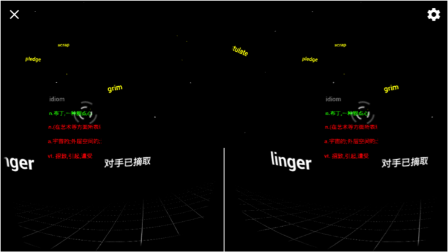
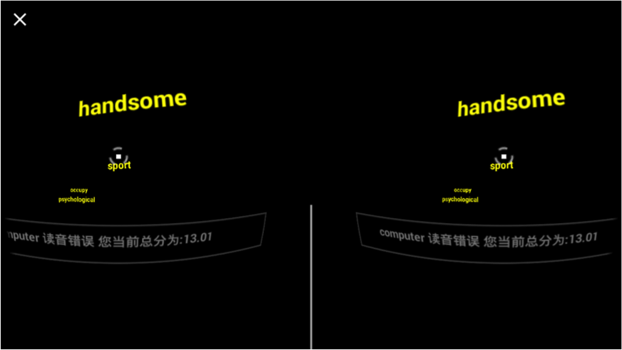
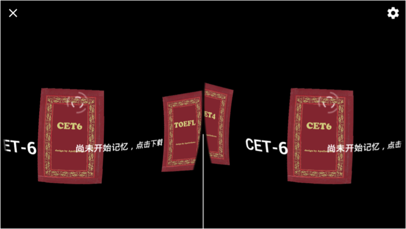

# WordWorld Introduction

一款基于Google Cardboard的VR背单词软件 :D

An Android app for VR English study, based on the Google cardboard API. :D

- Muliple online VR game (StarryNight)

- VR pronounce game (SpeakBloom)

- Support words list of GRE, TOEFL, CET4/6 and etc

## Developer
Yifan Qin,Zixiong Su,Yihui Zhong,Yingyue Li,Yi Ding